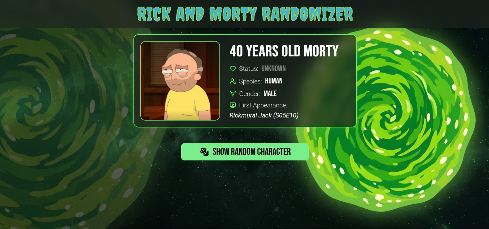

# 🚀 RICK AND MORTY CHARACTER RANDOMIZER

> Proyecto web para mostrar personajes aleatorios de la serie de TV "Rick and Morty". 

---

## 🔗 Enlaces Importantes
- **Demo en vivo:** [Ver Proyecto](https://rick-and-morty-random.netlify.app/)

## 📸 Vista Previa

## 🛠️ Tecnologías y Herramientas
- **HTML5:** Estructura semántica.
- **CSS3:** Layouts con Flexbox/Grid y uso de media queries para versiones responsivas.
- **Google Fonts:** Tipografías personalizadas.
- **Rick and Morty API:** [Fuente de datos](https://rickandmortyapi.com/).
- **SpinKit:** [Galería de spinners](https://tobiasahlin.com/spinkit/).
- **Lucide:** [Galería de iconos SVG gratuitos](https://lucide.dev/).
- **Fontawesome:** [Galería de iconos SVG gratuitos de y paga](https://lucide.dev/).

## ✨ Características (Features)
- [x] **Diseño Responsive:** Adaptado para móviles, tablets y escritorio.
- [x] **Manejo de peticiones:** Uso de Fetch API para manejar peticiones y consumir datos de la API.
- [x] **Manejo de errores:** Manejo de errores mediante sistemas de alertas en caso de no encontrar el recurso deseado o una falla en la conexión.
- [x] **Uso de spinners:** Para tiempos de carga en lo que se obtienen los datos correspondientes.
- [x] **Uso de Normalize.css:** Formateo de estilos de diversos navegadores.

## 📝 Lo que aprendí en este proyecto
Durante el desarrollo de este proyecto, reforcé mis bases técnicas y mejoré mi flujo de trabajo como desarrollador. Algunos de los aprendizajes clave incluyen:

- **Maquetación sin frameworks:** Construcción de una interfaz sólida utilizando **HTML, CSS y JS** puro, comprendiendo a fondo el comportamiento de los elementos en el DOM.
- **Uso básico de Fetch API para consumir datos:** Uso de la API **Rick and Morty API** para consumir datos por medio de Fetch API, mediante el concepto base de promesas, además de manejo de errores en caso de que las promesas se cumplan o no.

## 👤 Autor
- **[Toothed20]** - *Estudiante de Ingeniería en Sistemas Computacionales*
- [GitHub](https://github.com/Toothed20)

---
*Este proyecto fue desarrollado con fines educativos y forma parte de mi proceso de aprendizaje continuo en desarrollo web.*